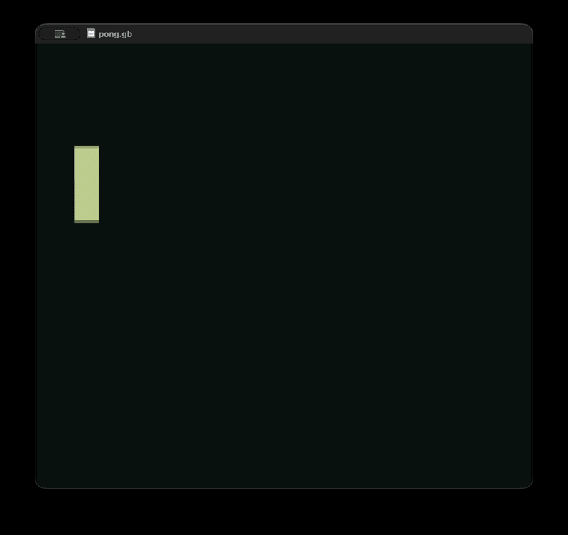

<h1 align=center>Pong Variations</h1>

<h3 align=center><em>Pong, Hand-Written for Real Game Boy Hardware</em></h3>

<p align=center>
    <a href="https://gbdev.io/gb-asm-tutorial/part1/assembly.html"></img></a>
    <a href="https://rgbds.gbdev.io/"></img></a>
    <a href="https://sameboy.github.io/"></img></a>
    <a href="https://zed.dev/"></img></a>
</p>

A Game Boy ROM, hand-written in SM83 assembly (RGBDS), implementing a variation on Pong: a single player-controlled paddle bounces a ball off the top and bottom walls, aiming to keep it in play. Built from scratch: tile data, OAM sprite handling, VBlank-synced input, and collision detection, with no engine underneath it.

<p align=center>
    </img>
</p>

---

### _Sections_

1. [**Project Structure**](#project-structure)
2. [**Status**](#status)
3. [**Building**](#building)
4. [**Controls**](#controls)
5. [**Resources**](#resources)

---

### _Project Structure_

```
src/
├── lib
│   ├── hardware.inc ; standard RGBDS hardware register/constant definitions
│   └── objects.asm  ; paddle and ball tile data
└── pong.asm         ; entry point, main loop, input handling, ball physics, collision, interrupt handler
```

<br>

### _Status_

In active development. Currently:

- Paddle renders as three stacked 8×8 tiles and moves with Up/Down, clamped to the screen bounds.
- Ball renders and moves diagonally every frame, bouncing off the top and bottom walls.
- Ball-paddle collision detection is wired up (bounding-box check against the paddle's X plane and Y span).
- Ball resets after any player "scores".
- No scoring, AI, second paddle, or right-wall handling yet.

<br>

### _Building_

Requires [**RGBDS**](https://rgbds.gbdev.io/) 0.5.0 or later.

```bash
cd src
make        # assemble, link, and fix the ROM -> pong.gb
make run    # open pong.gb in the default Game Boy emulator
make clean  # remove build artifacts (pong.gb, pong.o, pong.sym)
```

Load the resulting `pong.gb` in [**SameBoy**](https://sameboy.github.io/) or any other Game Boy emulator (or flash it to a cartridge for the real thing).

<br>

### _Controls_

| Button | Action        |
|--------|---------------|
| Up     | Move paddle up   |
| Down   | Move paddle down |

<br>

### _Resources_

- [**gb-asm-tutorial**](https://gbdev.io/gb-asm-tutorial/): primary source for the underlying course material
- [**Pan Docs**](https://gbdev.io/pandocs/): the Game Boy hardware bible
- [**RGBDS Documentation**](https://rgbds.gbdev.io/docs/)
- [**gbdev hardware.inc**](https://github.com/gbdev/hardware.inc): the hardware register/constant definitions this project includes
- [**SameBoy**](https://sameboy.github.io/): emulator/debugger used throughout development
